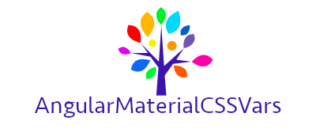

<p align="center"></p>

You want to style your angular material dynamically with all the colors in the rainbow? Look no further!

[Check out the Demo!](https://johannesjo.github.io/angular-material-css-vars/)

## Setup

1. Install:
   ```bash
   npm i angular-material-css-vars -S
   ```
2. If @angular/material is already configured remove `@include mat.core()` from your main stylesheet file if present.
3. Add this to your main stylesheet instead:

   ```scss
   @use "angular-material-css-vars" as mat-css-vars;

   @include mat-css-vars.init-material-css-vars();
   ```

4. Add to your main module:

```typescript
import { MaterialCssVarsModule } from "angular-material-css-vars";

@NgModule({
  imports: [
    MaterialCssVarsModule.forRoot({
      // all optional
      isAutoContrast: true,
      primary: "#3f51b5",
      // ...
    }),
  ],
})
export class AppModule {}
```

In standalone workspaces, add the following to your `app.config.ts`:

```typescript
import { ApplicationConfig } from "@angular/core";
import { provideMaterialCssVars } from "angular-material-css-vars";

export const appConfig: ApplicationConfig = {
  providers: [
    provideMaterialCssVars({
      // all optional
      isAutoContrast: true,
      primary: "#3f51b5",
      // ...
    }),
  ],
};
```

5. If you want to adjust the theme at runtime, you can use `MaterialCssVarsService`:

   ```typescript
   import { MaterialCssVarsService } from "angular-material-css-vars";

   export class SomeComponentOrService {
     constructor(public materialCssVarsService: MaterialCssVarsService) {
       const hex = "#3f51b5";
       this.materialCssVarsService.setDarkTheme(true);
       this.materialCssVarsService.setPrimaryColor(hex);
       this.materialCssVarsService.setAccentColor("#333");
     }
   }
   ```

> Angular Material v18 introduced stable support for M3 theme.
> For now, this library only supports M2.
> More information can be found in this [issue](https://github.com/johannesjo/angular-material-css-vars/issues/166).

## Additional Features

- Auto or manually set contrast color via
  - `setAutoContrastEnabled(bool)`
  - `setContrastColorThreshold(hueVal: HueValue)`
- Helper to set all variables
  - `setVariable(cssVarName: MaterialCssVariables, value: string)`
  - You can use the `MaterialCssVariables` enum [from here](https://github.com/johannesjo/angular-material-css-vars/blob/master/projects/material-css-vars/src/lib/model.ts) to make sure you get the variable name right.
- Rudimentary dark theme support via body class
  - `setDarkTheme(isDark: boolean)`

## Utility

There are also several [utility functions and mixins](https://github.com/johannesjo/angular-material-css-vars/blob/master/projects/material-css-vars/src/lib/_public-util.scss).

```scss
@use "angular-material-css-vars" as mat-css-vars;

.with-color {
  border-color: mat-css-vars.mat-css-color-primary(300);
}

.color-and-contrast {
  @include mat-css-vars.mat-css-color-and-contrast(300);
}

.with-bg {
  @include mat-css-vars.mat-css-bg(300);
}
```

There are also [some additional hacks](additional-hacks.md) (e.g. adding a color to the elevation shadow) available in case you need them.

## Initialization Options

You can provide different options before initialization to change the body class used for the dark theme and to provide different default styles:

```scss
...
@use 'angular-material-css-vars' as mat-css-vars with (
  $dark-theme-selector: '.isDarkTheme',
  $light-theme-selector: '.isLightTheme'
);
...

@include mat-css-vars.init-material-css-vars();

```

### Set default (fallback palettes)

There are two ways to set the default fallback theme. One is using the `mat-css-palette-defaults` mixin.

```scss
@use "angular-material-css-vars" as mat-css-vars;
@use "@angular/material" as mat;

@include mat-css-vars.init-material-css-vars();

@include mat-css-vars.mat-css-set-palette-defaults(mat.$light-blue-palette, "primary");
@include mat-css-vars.mat-css-set-palette-defaults(mat.$pink-palette, "accent");
@include mat-css-vars.mat-css-set-palette-defaults(mat.$red-palette, "warn");
```

The other is to include your own variables for [$default-light-theme](https://github.com/johannesjo/angular-material-css-vars/blob/master/projects/material-css-vars/src/lib/_variables.scss).

```scss
@use "angular-material-css-vars" as mat-css-vars with (
  $default-light-theme: (
    --palette-primary-50: mat-css-vars.hex-to-rgb(#e1f5fe),
    --palette-primary-100: mat-css-vars.hex-to-rgb(#b3e5fc),
    --palette-primary-200: mat-css-vars.hex-to-rgb(#81d4fa),
    --palette-primary-300: mat-css-vars.hex-to-rgb(#4fc3f7),
    --palette-primary-400: mat-css-vars.hex-to-rgb(#29b6f6),
    --palette-primary-500: mat-css-vars.hex-to-rgb(#03a9f4),
    // ...
  )
);

@include mat-css-vars.init-material-css-vars();
```

### Set global density

To set the global density level, just pass the `$density` variable to the `init-material-css-vars()` mixin like the following:

```scss
@use "angular-material-css-vars" as mat-css-vars;

@include mat-css-vars.init-material-css-vars($density: -2);
```

## App Theme Mixins

The `init-material-css-vars` mixin allows content to be passed into it. This allows you to create app themes that can take advantage of the dynamic theme created inside this mixin. It may be possible to do all theming using the utility mixins outlined above, but in other cases, you may need access to the theme palette, including foreground and background palettes.

See the Material guide on [Theming your custom component](https://material.angular.io/guide/theming-your-components) for more information.

## Font config

If needed the typography can be adjusted as well. You can introduce your own CSS variables, if you wish.

```scss
@use "angular-material-css-vars" as mat-css-vars;
@use "@angular/material" as mat;

// example
$custom-typography: mat.define-typography-config(
  // optionally, you introduce your own CSS variables: `$font-family: var(--my-custom-font-family)`
  $font-family: "Roboto, monospace",
  $headline: mat.define-typography-level(32px, 48px, 700),
  $body-1: mat.define-typography-level(16px, 24px, 500)
);

@include mat-css-vars.init-material-css-vars($typography-config: $custom-typography) using($mat-css-theme) {
  @include app-theme($mat-css-theme);
}

@mixin app-theme($theme) {
  // Your app theme
}
```

## Legacy components support

Angular Material v15 introduces MDC based components, which is basically a re-write for a lot of the available components. `angular-material-css-vars` v5+ only supports MDC components.

In case you are still using the legacy components, you can use the package [angular-material-css-vars-legacy](https://github.com/json-derulo/angular-material-css-vars-legacy).

## Angular compatibility table

| Angular | angular-material-css-vars |
|---------|---------------------------|
| 19      | 8.x                       |
| 18      | 7.x                       |
| 17      | 6.x                       |
| 16      | 5.x                       |
| 15      | 4.x                       |
| 13/14   | 3.x                       |
| 12      | 2.x                       |
| 11      | 1.x                       |

## Credit...

...goes to @zbirizdo [project](https://github.com/zbirizdo/material-css-vars) on which parts of this are based which is in turn supposedly based on [this gist](https://gist.github.com/shprink/c7f333e3ad51830f14a6383f3ab35439).

...and to @pedrojrivera without whom there would be no support for @angular/material v12.

## Development server

Run `ng serve` for a dev server. Navigate to `http://localhost:4200/`. The app will automatically reload if you change any of the source files.
